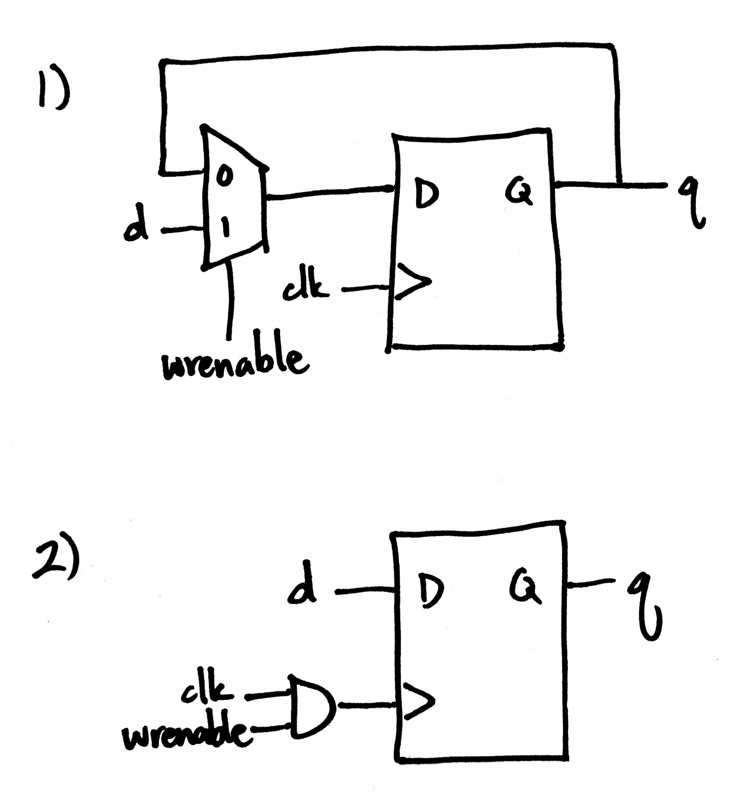

# Writeup

## Deliverable 1



## Deliverable 6

The '<<'' operator is a binary left shift; the address determines how far the
enable bit is shifted left in the output. The enable bit will thus be stored in
the location in the output that corresponds to the address. The other bits are set
to 0. If enable is 1, output[address] will be 1 and the other bits will be 0. If
enable is 0, all the bits will be 0. This is the same behavior as in a decoder:
if enable is 1, only the bit corresponding to the address in the output will be 1;
in other words, only the option corresponding to the address will be selected.
Otherwise, nothing will be selected.

## Test Scripts

```shell
iverilog -o regfile regfile.t.v
./regfile
```
